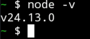
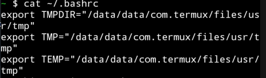

# INSTALL OPENCLAW ON ANDROID

## 1. ENVIRONMENT

- DEVICE: Old android phone
- CPU: ARM64
- It's better if u have Windows 11 and can remove control phone via ["Phone Link"]("https://www.microsoft.com/en-us/windows/sync-across-your-devices")
- Vivo phone can connect via ["vivo 办公套件"](https://pc.vivo.com/#/)

## 2. INSTALLATION

- Download termux app via [F-Droid](https://f-droid.org/en/packages/com.termux/)
- Install termux app

- Open termux app
- Install nodejs

```bash
pkg update -y && pkg upgrade -y
pkg install -y git nodejs-lts python cmake vim jq
```

- check node install success

```bash
node -v
```



- install openclaw(it will take more than 10 minutes, just wait if no error)

```bash
npm install -g openclaw@latest
```

- set up TEMP env in user bashrc

```bash
echo "export TMPDIR=\"/data/data/com.termux/files/usr/tmp\"" >> ~/.bashrc
echo "TMP=\"$TMPDIR\"" >> ~/.bashrc
echo "TEMP=\"$TMPDIR\"" >> ~/.bashrc

source ~/.bashrc
env | grep -i tmp
```



- create openclaw config file

```bash
mkdir ~/.openclaw
touch ~/.openclaw/config.json
mkdir -p /data/data/com.termux/files/usr/tmp/openclaw/
```

- add net config to ~/.openclaw/config.json

```json
{
    "logging":{
        "level":"info",
        "file":"/data/data/com.termux/files/usr/tmp/openclaw/openclaw-YYYY-MM-DD.log"
    }
}

```

- start openclaw server and set config

```bash
OSTYPE=linux-gnu openclaw gateway
```
